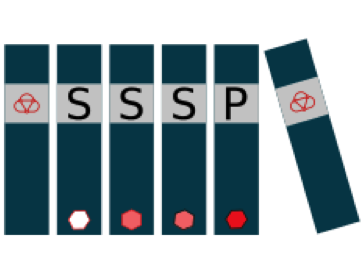

The aiida-sssp-workflow plugin for `AiiDA`_
=====================================================

``aiida-sssp-workflow`` is available at http://github.com/aiidateam/aiida-sssp-workflow

.. toctree::
   :maxdepth: 2

   user_guide/index
   developer_guide/index
   API documentation <autoapi/index.rst>

If you use this plugin for your research, please cite the following work:

.. highlights:: SSSP: G. Prandini, A. Marrazzo, I. E. Castelli, N. Mounet and N.
  Marzari, npj Computational Materials 4, 72 (2018);
  https://www.nature.com/articles/s41524-018-0127-2

.. highlights:: K. Lejaeghere et al., Science 351 (6280), 1415 (2016).
  http://molmod.ugent.be/deltacodesdft

If you use AiiDA for your research, please cite the following work:

.. highlights:: Giovanni Pizzi, Andrea Cepellotti, Riccardo Sabatini, Nicola Marzari,
  and Boris Kozinsky, *AiiDA: automated interactive infrastructure and database
  for computational science*, Comp. Mat. Sci 111, 218-230 (2016);
  https://doi.org/10.1016/j.commatsci.2015.09.013; http://www.aiida.net.

``aiida-sssp-workflow`` is released under the MIT license.

Please contact morty.yeu@gmail.com for information concerning ``aiida-sssp-workflow`` and the `AiiDA mailing list <http://www.aiida.net/mailing-list/>`_ for questions concerning ``aiida``.

Indices and tables
==================

* :ref:`genindex`
* :ref:`modindex`
* :ref:`search`

.. _AiiDA: http://www.aiida.net
